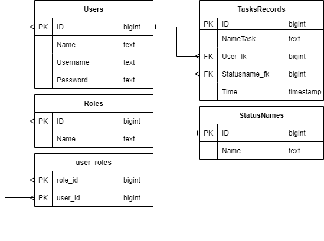

## Менеджер задач
REST приложение для отслеживания задач. Выполнено с применением фреймворка Spring Boot, авторизация реализована через Spring Security, подключена база данных PostgreSQL. Упаковано в docker контейнеры. Для удобства взаимодействия и наглядности использования сделан простейший фронтэнд на шаблонах Thymeleaf.

Для развертывания приложения необходимо выполнить следующие действия:

1. Скачайте репозиторий на локальный диск
2. Для компиляции jar файла приложения введите команду `mvn package` 
3. Далее введите `docker-compose up -d`
4. После создания двух докер контейнеров сервис готов к работе

Файл backup.sql автоматически инициализирует тестовую базу данных со значениями

### Схема базы данных:

Сервис представляет из себя браузерное приложение, работу можно начать с ссылки

`localhost:8080/login`

Можно использовать тестовые учетные данные: логин `serg` пароль `test`, можно создать свои через кнопку "Добавить пользователя".

После авторизации будет переадресация на список задач, относящихся к этому человеку. Обращу внимание, что авторизация происходит с помощью передачи токена в Cookie, они должны поддерживаться браузером. Так же они имеют короткий срок жизни.

Следующая ссылка содержит страницу со всеми записями задач, их исполнителями и статусами

`localhost:8080/records`

Так же с помощью кнопки "Добавить задачу" можно перейти на экран добавления задач.
После добавления появляется новая запись на странице `/records` со статусом `RENDERING`, по прошествию 30 секунд появится запись о том, что задача завершена со статусом `COMPLETED`.
Имеется возможность найти конкретные задачи в общем списке, по статусу выполнения, и по исполнителю.

